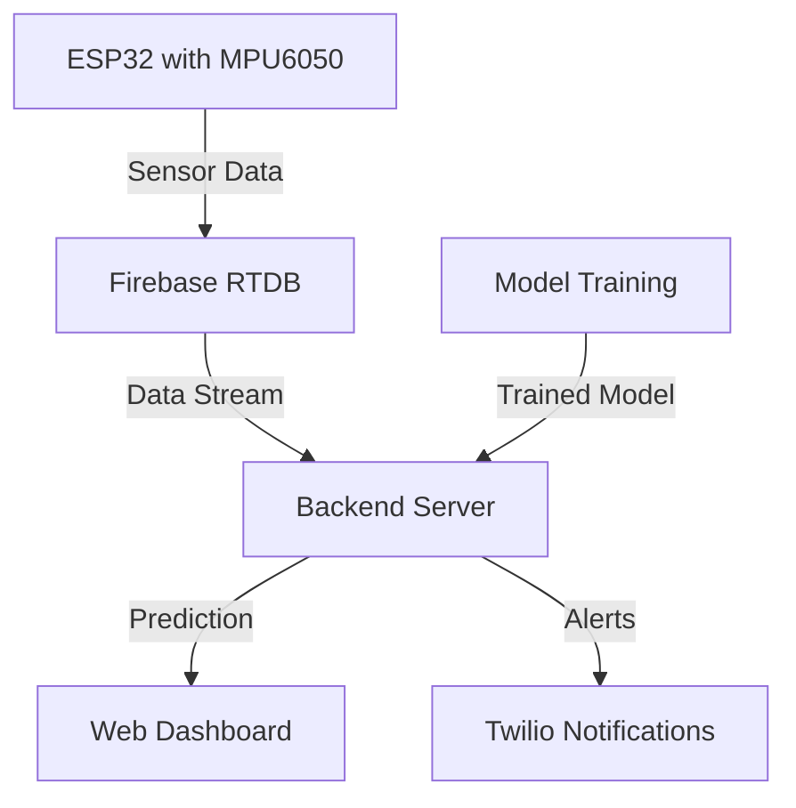

# AIoT Fall Detection System - Project Pipeline

This document outlines the complete end-to-end pipeline for the AIoT Fall Detection System, from data collection to deployment and monitoring.

## Table of Contents
1. [System Overview](#system-overview)
2. [Data Collection Pipeline](#data-collection-pipeline)
3. [Data Preprocessing](#data-preprocessing)
4. [Model Training](#model-training)
5. [Model Deployment](#model-deployment)
6. [Real-time Inference](#real-time-inference)
7. [Alerting System](#alerting-system)
8. [Monitoring & Maintenance](#monitoring--maintenance)
9. [Continuous Integration/Deployment](#continuous-integrationdeployment)
10. [Scaling & Optimization](#scaling--optimization)

## System Overview

The AIoT Fall Detection System follows this high-level workflow:



## Data Collection Pipeline

### 1. Hardware Setup
- **ESP32 Microcontroller** with MPU6050 6-axis IMU sensor
- Sampling rate: 50Hz (configurable)
- Data collected: 
  - Accelerometer (x, y, z)
  - Gyroscope (x, y, z)
  - Calculated features (amplitude, vector magnitude)

### 2. Data Collection Process
1. **Simulated Falls**: Controlled experiments with safety measures
2. **Activities of Daily Living (ADL)**: Normal movement patterns
3. **Data Format** (CSV):
   ```
   timestamp,ax,ay,az,gx,gy,gz,label
   1234567890,0.5,-0.2,9.8,0.1,0.2,-0.1,0
   ```

### 3. Data Storage
- Raw data stored in `data/fall/` and `data/non_fall/` directories
- Each session saved with timestamp and metadata
- Backup to cloud storage (optional)

## Data Preprocessing

### 1. Data Loading
- Load CSV files from data directories
- Combine multiple sessions
- Handle missing values and outliers

### 2. Feature Engineering
- **Time-domain features**:
  - Moving averages
  - Standard deviation
  - Signal magnitude area (SMA)
  - Signal vector magnitude (SVM)
- **Frequency-domain features** (FFT)
- **Window-based processing** (2-second windows with 50% overlap)

### 3. Feature Scaling
- StandardScaler for normalization
- Save scaler for inference

## Model Training

### 1. Model Architecture
- **Algorithm**: Random Forest Classifier
- **Input Features**:
  ```python
  ['amp10x', 'gvec', 'az', 'ax', 'ay', 'gz_spike', 'gx', 'gy', 'gz']
  ```
- **Output**: Binary classification (Fall/No Fall)

### 2. Training Process
- 80/20 train-test split
- 5-fold cross-validation
- Hyperparameter tuning with GridSearchCV
- Class balancing with SMOTE (if needed)

### 3. Evaluation Metrics
- Accuracy
- Precision/Recall
- F1-Score
- Confusion Matrix
- ROC-AUC

### 4. Model Persistence
- Save trained model as `trained_model.pkl`
- Save feature order as `feature_order.json`
- Generate training report

## Model Deployment

### 1. Backend Server
- **Framework**: Flask
- **Endpoints**:
  - `POST /predict`: Real-time inference
  - `GET /dashboard`: Serve web interface
  - `GET /api/status`: System health check

### 2. Firebase Integration
- Real-time data synchronization
- Device management
- Data logging

### 3. Web Dashboard
- Real-time sensor visualization
- Fall alerts and notifications
- Historical data review
- System configuration

## Real-time Inference

### 1. Data Flow
1. ESP32 sends sensor data to Firebase RTDB
2. Backend listens for new data
3. Preprocess incoming data
4. Run inference using trained model
5. Update dashboard and trigger alerts if fall detected

### 2. Performance
- Inference time: < 100ms
- Support for multiple concurrent devices
- Automatic reconnection on failure

## Alerting System

### 1. Notification Channels
- **SMS**: Immediate alerts via Twilio
- **Email**: Detailed reports
- **Dashboard**: Real-time alerts

### 2. Alert Content
- Fall detection timestamp
- Fall probability
- Device location (if available)
- Quick action buttons

### 3. Rate Limiting
- Prevent alert fatigue
- Configurable cooldown periods
- Escalation rules

## Monitoring & Maintenance

### 1. System Health
- Uptime monitoring
- Resource usage (CPU, memory, disk)
- Error logging

### 2. Model Monitoring
- Prediction drift detection
- Data quality checks
- Performance metrics

### 3. Logging
- Structured logging with timestamps
- Error tracking
- Audit trail

## Continuous Integration/Deployment

### 1. Testing
- Unit tests
- Integration tests
- Load testing

### 2. CI/CD Pipeline
- Automated testing
- Containerization with Docker
- Deployment to production

### 3. Version Control
- Git workflow
- Branching strategy
- Release management

## Scaling & Optimization

### 1. Horizontal Scaling
- Load balancing
- Microservices architecture
- Caching strategies

### 2. Performance Optimization
- Model quantization
- Batch processing
- Asynchronous processing

### 3. Future Enhancements
- Edge deployment with TensorFlow Lite
- Federated learning
- Multi-sensor fusion

## Security Considerations

1. **Data Encryption**
   - TLS for data in transit
   - Encryption at rest
   - Secure API authentication

2. **Access Control**
   - Role-based access
   - API key management
   - Audit logging

3. **Compliance**
   - GDPR/CCPA compliance
   - Data retention policies
   - Privacy by design

## Troubleshooting

### Common Issues
1. **Connection Drops**
   - Check Firebase credentials
   - Verify network connectivity
   - Review error logs

2. **Model Performance**
   - Check data quality
   - Retrain with new data
   - Adjust threshold values

3. **Alert Failures**
   - Verify Twilio credentials
   - Check rate limits
   - Review notification logs

## Support

For issues and feature requests, please open an issue on our [GitHub repository](https://github.com/yourusername/aiot-fall-detector).

## License

This project is licensed under the MIT License - see the [LICENSE](LICENSE) file for details.
